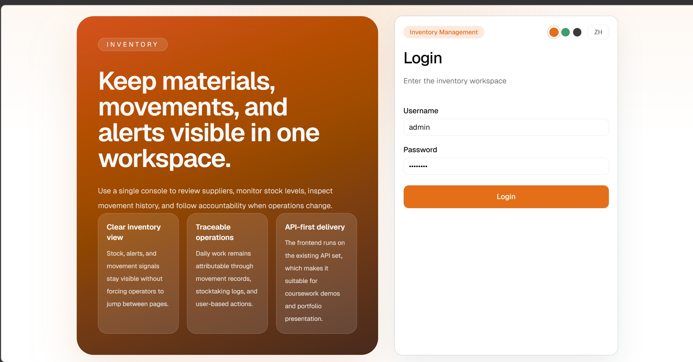
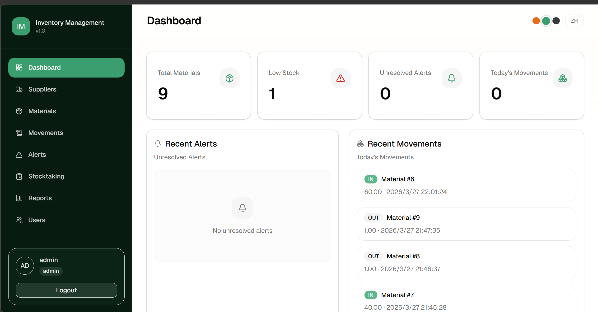
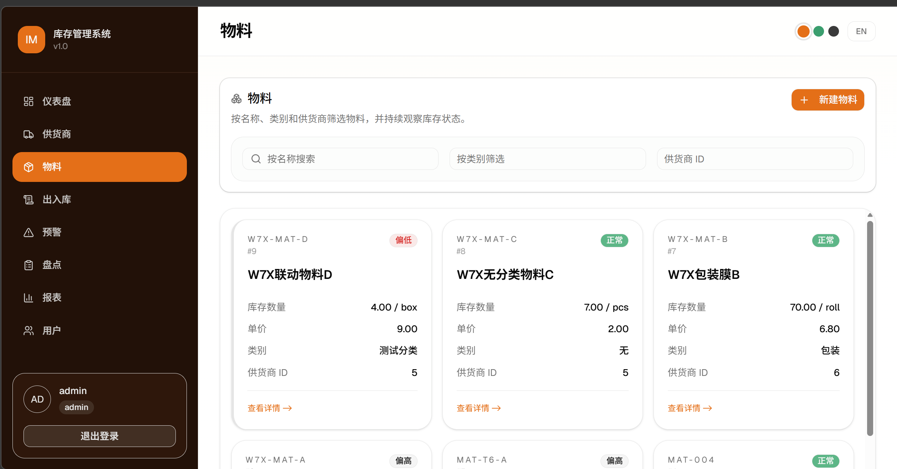
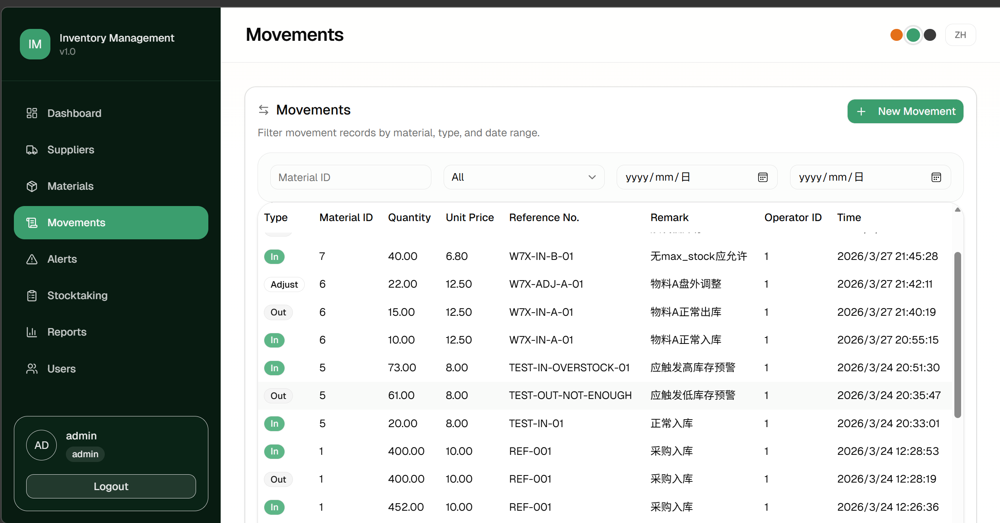

# 库存管理系统

全栈库存管理 Web 应用。Go 后端 + React 前端，通过 `go:embed` 打包为**单一可执行文件**，无需分别部署。



## 截图

### 仪表盘


### 物料管理


### 出入库记录


## 技术栈

**后端**
- Go 1.26+ · [chi v5](https://github.com/go-chi/chi) · PostgreSQL（pgx/v5）· JWT（golang-jwt/v5）· godotenv · golang-migrate · sqlc

**前端**
- React 19 · TypeScript 5.9 · Vite 8 · Tailwind CSS v4 · shadcn/ui · React Router v7 · Zustand v5 · react-i18next · Axios · lucide-react

## 核心亮点

- **单二进制部署** — `pnpm build` + `go build`；Go 二进制内嵌并托管完整的 React SPA
- **三套主题色** — 果汁橙（默认）/ 薄荷绿 / 沥青灰；写入 `localStorage`，React 渲染前同步应用，无颜色闪烁
- **中英双语** — 界面语言一键切换，默认英文，写入 `localStorage` 持久化
- **JWT 认证 + 路由守卫** — 未登录自动跳转 `/login`
- **角色权限控制** — Admin 与 Staff 均可操作所有业务数据；仅 Admin 可创建新用户
- **局部滚动表格** — 各页面自带滚动容器，`<thead>` 在容器内 sticky 置顶
- **完整业务模块** — 仪表盘 · 供货商 · 物料 · 出入库 · 预警 · 盘点 · 月报 · 用户管理

## 项目结构

```
inventory-management/
├── cmd/server/main.go      # 程序入口
├── internal/
│   ├── config/             # 环境配置加载
│   ├── db/                 # pgx 连接池
│   ├── handler/            # HTTP 处理器 + DTO
│   ├── middleware/         # JWT 认证
│   ├── repository/         # sqlc 生成的查询代码
│   ├── router/             # chi 路由注册 + SPA fallback
│   └── service/            # 业务逻辑
├── queries/                # sqlc SQL 源文件
├── migrations/             # golang-migrate SQL 迁移文件
├── api/api.http            # HTTP 请求示例
├── docs/images/            # README 截图资源
├── embed.go                # go:embed all:web/dist
├── sqlc.yaml
├── Makefile
├── web/                    # 前端源码
│   ├── src/
│   │   ├── api/            # Axios 客户端 + 请求函数
│   │   ├── components/     # 应用壳 + shadcn/ui 组件
│   │   ├── i18n/           # en / zh-CN 翻译文件
│   │   ├── layouts/        # 路由布局包装器
│   │   ├── lib/            # 工具函数
│   │   ├── pages/          # 路由页面组件
│   │   ├── store/          # Zustand 认证状态
│   │   └── types/          # 共享 TypeScript 类型
│   └── vite.config.ts
└── go.mod
```

## 快速开始

**环境要求：** Go 1.26+、Node.js 20+ / pnpm 9+、PostgreSQL 15+

```bash
# 1. 克隆并配置
git clone https://github.com/your-username/inventory-management.git
cd inventory-management
cp .env.example .env        # 填写 DB_HOST、DB_PORT、DB_USER、DB_PASSWORD、DB_NAME、JWT_SECRET 等

# 2. 执行数据库迁移
make migrate-up

# 3. 构建前端
cd web && pnpm install && pnpm build && cd ..

# 4. 构建并运行
go build -o inventory-management .
./inventory-management      # 服务启动于 http://localhost:8080
```

## 开发模式

```bash
# 终端 1 — 后端（可配合 air 热重载）
go run ./cmd/server/main.go

# 终端 2 — 前端开发服务器（/api 代理到 :8080）
cd web && pnpm dev
```

## API 一览

| 模块 | 接口 |
|------|------|
| 健康检查 | `GET /api/healthz` |
| 认证 | `POST /api/auth/login` |
| 供货商 | `GET /api/suppliers` · `GET /api/suppliers/{id}` · `POST /api/suppliers` |
| 物料 | `GET /api/materials` · `GET /api/materials/{id}` · `POST /api/materials` |
| 出入库 | `GET /api/stock/movements` · `POST /api/stock/movements` |
| 预警 | `GET /api/alerts` · `POST /api/alerts/{id}/resolve` |
| 盘点 | `GET/POST /api/stocktaking` · `GET /api/stocktaking/{id}` · `GET/POST /api/stocktaking/{id}/items` · `POST /api/stocktaking/{id}/confirm` |
| 报表 | `GET /api/reports/monthly` |
| 用户 | `GET /api/users` · `PATCH /api/users/{id}/password` · `POST /api/users` *(仅 Admin)* |

## 许可证

MIT
